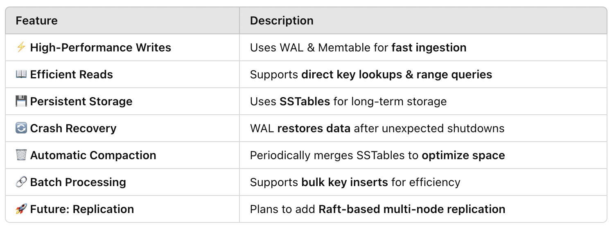
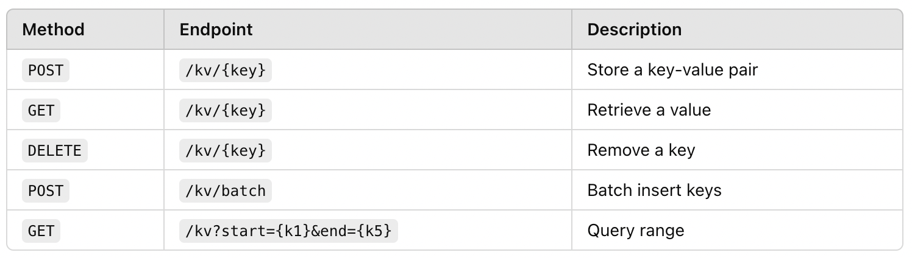

# Moniepoint Key/Value Store

## Overview
This project implements a **network-available persistent Key/Value store**, inspired by **Bigtable, Bitcask, LSM-trees,** and **Raft.** It is designed for:

- **Low-latency, high-throughput** reads and writes.
- **Scalability** to handle datasets larger than RAM.
- **Crash recovery** with **WAL (Write-Ahead Log).**
- **Efficient range queries** via sorted SSTables.
- **Automatic compaction** to optimize storage.

Planned **future improvements** include **data replication and automatic failover using Raft**.

---

## Features


## Architecture

### High-Level Overview
This system follows an **LSM-Tree (Log-Structured Merge-Tree) architecture**:

- **WAL (Write-Ahead Log)** ensures crash recovery.
- **Memtable** enables fast in-memory writes and reads.
- **SSTables** store persistent, sorted data for efficient lookups.
- **Compaction Process** periodically merges SSTables.

### **Diagrams**
Full **architectural decisions**, see the [ADR Document](docs/ADR.md).

- 📌 **[Write Path Diagram](docs/images/write_path.png)**
- 📌 **[Read Path Diagram](docs/images/read_path.png)**
- 📌 **[Compaction Flow Diagram](docs/images/compaction_flow.png)**
- 📌 **[WAL Flow Diagram](docs/images/wal_flow.png)**


## Performance Benchmarks

Full **Testing Document**, see the [Testing Document](docs/TESTING.md).

### 📌 **Key Performance Metrics**
- **⚡ Write Performance:** **3.75M WAL Writes/sec**
- **🏎️ Read Performance:** **~14ns for SSTable Lookups**
- **🔄 Recovery Speed:** **WAL Replay ~17.7ms**

📈 **[Full Benchmark & Stress Test Results](docs/BENCHMARK.md)**

## Getting Started

#### **Running Locally**

   ```sh
   docker run -p 8080:8080 --name moniepoint moniepoint
   ```

 Or manually run:
   ```sh
   go run cmd/server/main.go
   ```

**The server should be running at** `localhost:8080`:
   ```sh
   curl -X GET http://localhost:8080/health
   ```


## API Endpoints

<!--  -->


Full **API Document**, see the [Testing Document](docs/API.md).


## Project Structure
```
keyvaluestore/
├── cmd/
│   └── server/
│       └── main.go  # Server entry point
├── internal/
│   ├── api/
│   │   └── router.go  # Route definitions
│   ├── handler/
│   │   ├── request_handler.go  # Request delegation
│   │   ├── read_handler.go  # Read operations
│   │   ├── write_handler.go  # Write operations
│   │   ├── delete_handler.go  # Delete operations
│   ├── middleware/
│   │   ├── rate_limiter.go  # Request rate limiter
│   ├── storage/
│   │   ├── wal.go  # Write-ahead log (WAL)
│   │   ├── sstable.go  # SSTable persistence
│   │   ├── memtable.go  # In-memory storage
│   │   ├── compaction.go  # Background compaction
│   ├── config/
│   │   ├── config.go  # Configuration loader
├── Dockerfile  # Containerization setup
├── README.md  # Documentation
```

## **Future Enhancements**
- Implement **multi-node replication** for fault tolerance.
- Add **Bloom Filters** to optimize read performance.
- Improve **compaction strategy** to reduce write amplification.

---
