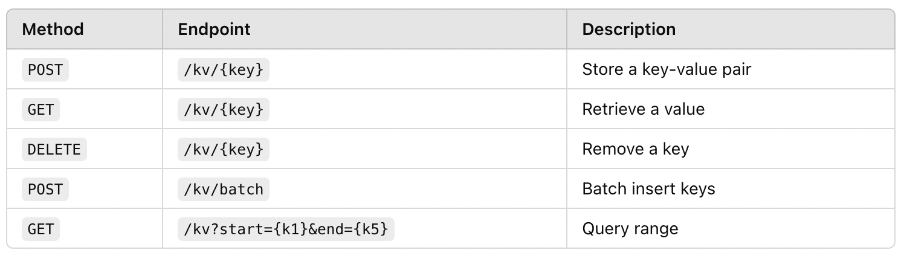

## API Endpoints



### **Write Key-Value Pair**
```sh
curl -X POST http://localhost:8080/kv/a -d '{"key": "txn123", "value": "approved"}' -H "Content-Type: application/json"
```

### **Read a Value**
```sh
curl -X GET http://localhost:8080/kv/a
```

### **Delete a Key**
```sh
curl -X DELETE http://localhost:8080/kv/a
```

### **Batch Write**
```sh
curl -X POST http://localhost:8080/kv/batch -d '[{"key": "txn1", "value": "approved"}, {"key": "txn2", "value": "failed"}]' -H "Content-Type: application/json"
```

### **Range Query**
```sh
curl -X GET "http://localhost:8080/kv/?start=txn1&end=txn5"
```
